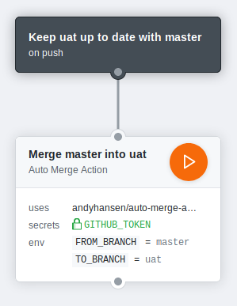

# Auto Merge GitHub Action

**Name:** `andyhansen/auto-merge-action`

Automatically merge from one branch into another when one is updated.
Will only attempt a merge when the branch specified in `FROM_BRANCH` is changed.

## Usage

This action requires access to your `GITHUB_TOKEN`, and supports two environment variables: `FROM_BRANCH` and `TO_BRANCH`.
Changes pushed to `FROM_BRANCH` will be automatically merged into `TO_BRANCH`.

- `FROM_BRANCH` defaults to `master`
- `TO_BRANCH` defaults to `uat`

### Example

An example `main.workflow` which updates the `uat` branch whenever changes are pushed `master`.

<p align="center">
  
</p>

```workflow
workflow "Keep uat up to date with master" {
  on = "push"
  resolves = ["Merge master into uat"]
}

action "Merge master into uat" {
  uses = "andyhansen/auto-merge-action@master"
  env = {
    FROM_BRANCH = "master"
    TO_BRANCH = "uat"
  }
  secrets = ["GITHUB_TOKEN"]
}
```
